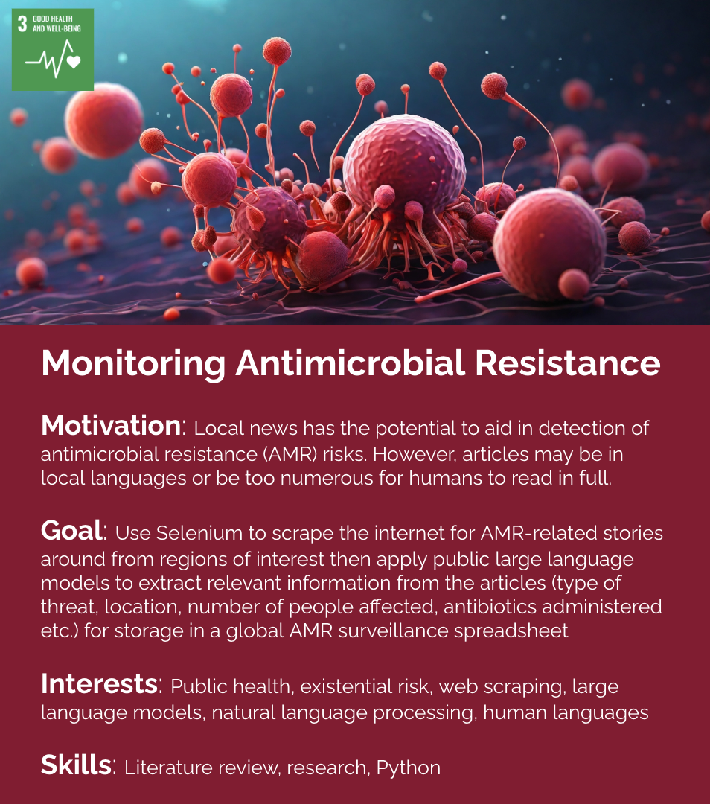

# Monitoring Antimicrobial Resistance

Local news has the potential to aid in detection of antimicrobial resistance (AMR) risks. However, articles may be in local languages or be too numerous for humans to read in full. In this project, we will use Selenium to scrape the internet for AMR-related stories around from regions of interest then apply public large language models to extract relevant information from the articles (type of threat, location, number of people affected, antibiotics administered etc.) for storage in a global AMR surveillance spreadsheet

### Team Meetings:
[When2Meet](https://www.when2meet.com/?24215173-AcjbN)

### Useful Links:

[How to Use ChatGPT for Web Scraping in 2024](https://oxylabs.io/blog/chatgpt-web-scraping)

[ChatGPT web scraping (with a bot) | axiom.ai](https://axiom.ai/blog/chatgpt-web-scraping)

[I’ve Created a Custom ChatGPT That Scrapes Data from Websites | by The PyCoach | Artificial Corner | Medium](https://medium.com/artificial-corner/ive-created-a-custom-gpt-that-scrapes-data-from-websites-9086aff58105)

[Using ChatGPT to build a database from web scraping? : r/ChatGPTCoding](https://www.reddit.com/r/ChatGPTCoding/comments/13hke7e/using_chatgpt_to_build_a_database_from_web/?onetap_auto=true&show_am=true)

[Strengthening Surveillance - Combating Antimicrobial Resistance and Protecting the Miracle of Modern Medicine - NCBI Bookshelf](https://www.ncbi.nlm.nih.gov/books/NBK577274/#:~:text=In%20the%20context%20of%20antimicrobial,infections%20caused%20by%20that%20pathogen.)

[Global Antimicrobial Resistance and Use Surveillance System (GLASS)](https://www.who.int/initiatives/glass)

[worldhealthorg.shinyapps.io/glass-dashboard/](https://worldhealthorg.shinyapps.io/glass-dashboard/_w_46070f49/#!/home)

[Drivers of Emerging Infectious Disease Events as a Framework for Digital Detection - PMC](https://www.ncbi.nlm.nih.gov/pmc/articles/PMC4517741/)

[A global dataset of pandemic- and epidemic-prone disease outbreaks | Scientific Data](https://www.nature.com/articles/s41597-022-01797-2)

[Early detection of emerging infectious diseases - implications for vaccine development - ScienceDirect](https://www.sciencedirect.com/science/article/pii/S0264410X23006308)

[Why AI Failed to Live Up to Its Potential During the Pandemic](https://hbr.org/2022/03/why-ai-failed-to-live-up-to-its-potential-during-the-pandemic)

[RPubs - Web scraping World Health Organization Communicable Disease data for NLP](https://rpubs.com/jffro88/Who-web-scraping)

[pdf](https://iopscience.iop.org/article/10.1088/1757-899X/912/6/062070/pdf)

[Tracking Antibiotic Resistance | CDC](https://www.cdc.gov/drugresistance/tracking.html)

### Example Articles:

[JN.1 Covid variant: WHO charts its rapid global spread - BBC News](https://www.bbc.co.uk/news/health-67772390)

[More than 300 patient lines per day in Surat civil, infections increased alarmingly among children and elderly, sales of drops increased 10 times, 4 to 5 crores of medicine sold | 'Ankh ahaa' disease worsens: Surat and Bhavnagar have the highest number of cases; In Surat Civil, 300 patients come daily, sales of eye drops increased 10 times - Surat News | Divya Bhaskar](https://www.divyabhaskar.co.in/local/gujarat/surat/news/more-than-300-patient-lines-per-day-in-surat-civil-infections-increased-alarmingly-among-children-and-elderly-sales-of-drops-increased-10-times-4-to-5-crores-of-medicine-sold-131545647.html)

[Indian man is first human to be infected by a plant fungus](https://www.telegraph.co.uk/global-health/science-and-disease/plant-fungal-infection-the-last-of-us/)
